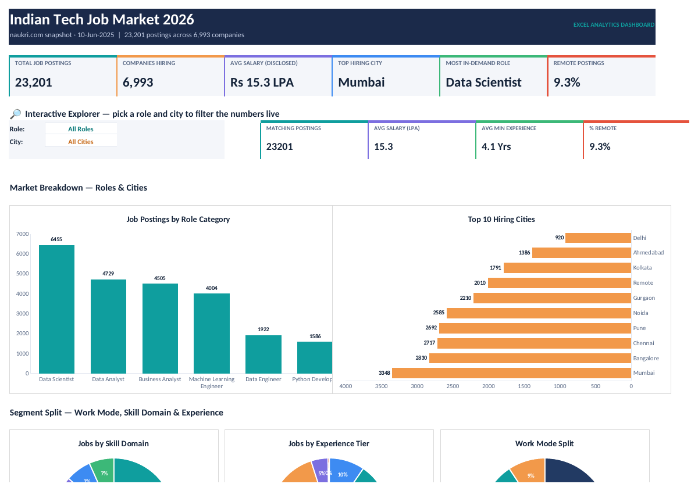
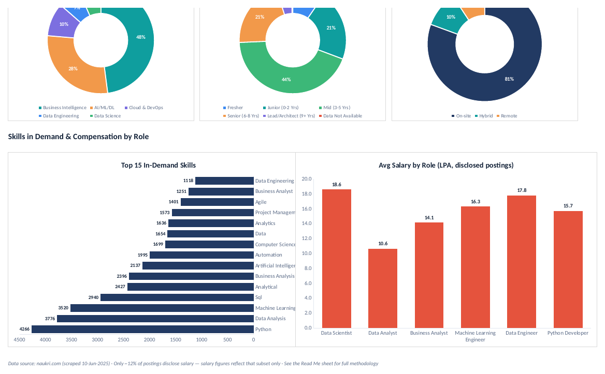
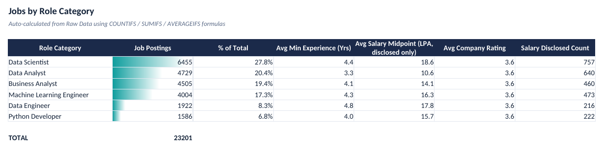
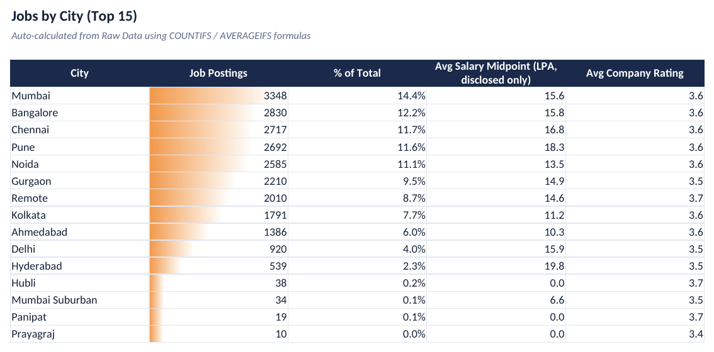
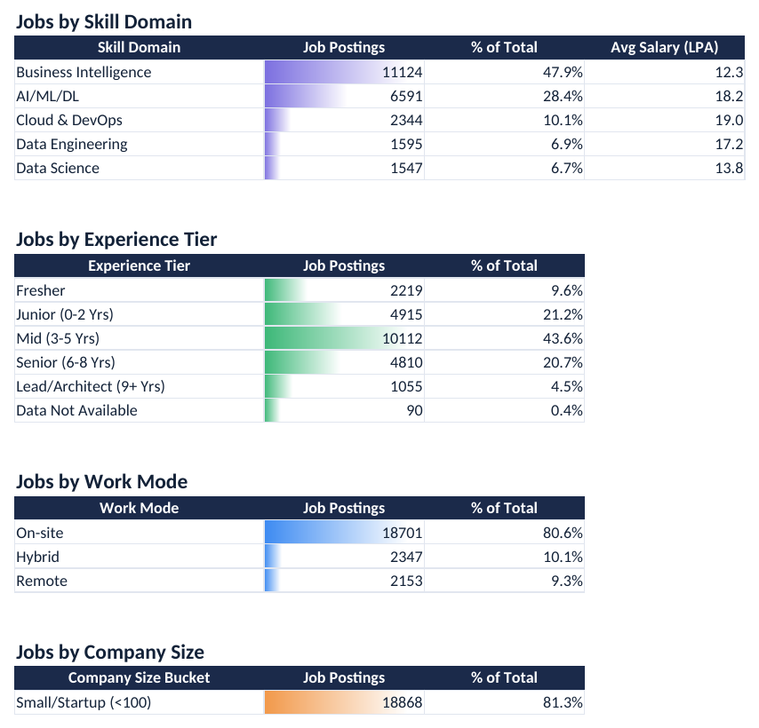
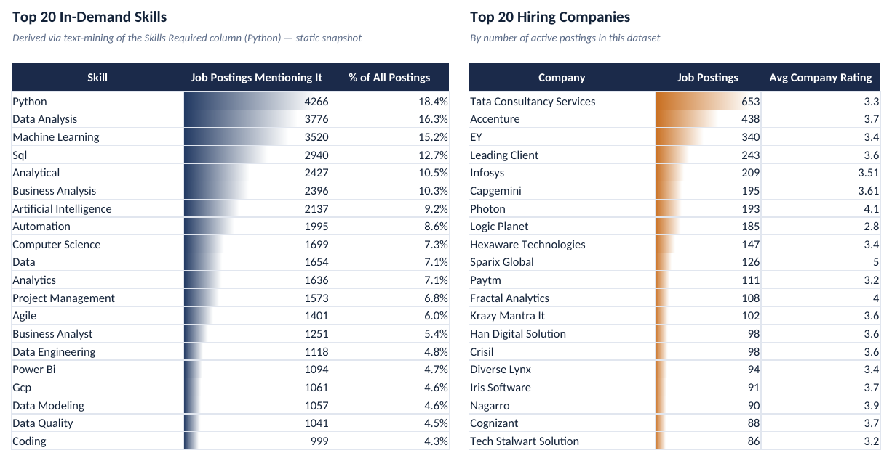

# Indian Tech Job Market 2026 Dashboard

This project analyzes the Indian tech hiring market using a cleaned dataset of job postings and a dashboard built in Microsoft Excel.

It helps answer questions like:

- Which roles are hiring the most?
- Which cities have the highest demand?
- Which skills appear most often in job descriptions?
- How do salaries vary by role and experience?
- What is the split between remote, hybrid, and on-site jobs?

## Overview

The dataset contains 23,201 job postings and covers major job categories such as:
- Data Scientist
- Data Analyst
- Business Analyst
- Machine Learning Engineer
- Data Engineer
- Python Developer

The dashboard helps explore market trends across:
- Job role demand
- Hiring activity by city
- Experience level distribution
- Work mode (remote, hybrid, on-site)
- In-demand skills
- Salary patterns and disclosure trends

## Project structure

- [indian-tech-job-market-2026-excel-dashboard](indian-tech-job-market-2026-excel-dashboard/) — main project folder
- [indian-tech-job-market-2026-excel-dashboard/data](indian-tech-job-market-2026-excel-dashboard/data/) — raw CSV dataset
- [indian-tech-job-market-2026-excel-dashboard/excel](indian-tech-job-market-2026-excel-dashboard/excel/) — Excel dashboard workbook
- [indian-tech-job-market-2026-excel-dashboard/images](indian-tech-job-market-2026-excel-dashboard/images/) — project screenshots
- [indian-tech-job-market-2026-excel-dashboard/docs](indian-tech-job-market-2026-excel-dashboard/docs/) — methodology and summary notes

## Main deliverable

Open the dashboard workbook here:
- [Indian_Tech_Job_Market_2026_Dashboard.xlsx](indian-tech-job-market-2026-excel-dashboard/excel/Indian_Tech_Job_Market_2026_Dashboard.xlsx)

## What this project includes

- Cleaned job market dataset
- Interactive Excel dashboard
- Role and city filter functionality
- Summary sheets for performance and trend analysis
- Visual charts and KPI cards
- Documentation covering the cleaning process and findings

## Dashboard preview

### Role summary

### City summary

### Other summary

### Top skills and hiring companies

## Documentation

For the complete data-cleaning methodology, analysis process, and key insights, see:
- [Project Summary](indian-tech-job-market-2026-excel-dashboard/docs/PROJECT_SUMMARY.md)

## Data source and notes

- Source: naukri.com job listing snapshot
- Dataset type: point-in-time market snapshot, not live data
- Salary figures reflect only the portion of postings that disclosed salary information
- Built for local Excel use and portfolio presentation

## Author

Shrikant Kshitij  
Data Analyst Trainee, CEPTA Infotech Pvt Ltd
